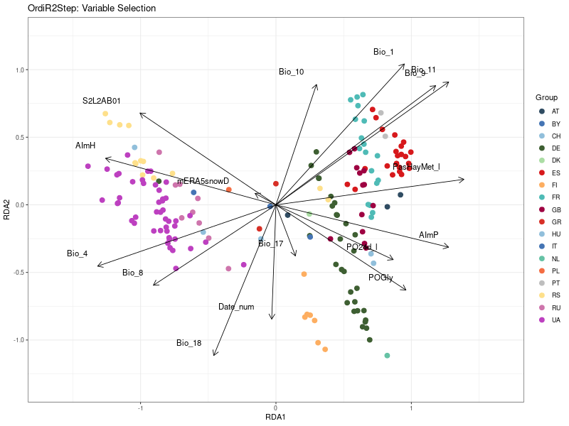

# Environmental Association Analysis
## FAIRiCUBE - Use Case 3 🪰 

##  Table of Contents

<!--ts-->

1. [About the Repository](#about-the-repository)
2. [Hypothesis and Research Questions](#hypothesis-and-research-questions)
3. [Novel Aspects](#novel-aspects)
4. [Data](#data)
   * [Genetic Data](#genetic-data)
   * [Environmental Data](#environmental-data)
5. [Project Workflow](#project-workflow)
6. [Results](#results)

<!--ts-->

---

## About the Repository

This repository is supposed to hold documentation on the Environmental Association Analysis Workflow conducted in the scope of the UC3 Project of [FAIRiCUBE](https://fairicube.nilu.no/).
The Use Case approach aims to identify how environmental factors shape genetic variation and influence evolutionary processes in european popualtions of Drosophila melanogaster. By correlating population genomics with environmental data, the study aims to uncover genetic targets affected by environmental selection pressures.
This is a standalone repository linking to other repository of the project work concerning the following topics. 

- Accessing and Processing Environmental Data with FAIRiCUBE
- Conducting EAA on the FAIRiCUBE HUB


---

##  Hypothesis and Research Questions

Many research has been conducted on the model organism Drosophila melanogaster. This previous research and collaboration efforts led to the accumulation of genetic data of D. melanogaster from these worldwide populations. The [DEST](https://dest.bio/) (Drosophila Evolution over Space and Time) dataset is a valuable collection of genomic data from natural populations across multiple locations worldwide and multiple time points. 

---
- How does environmental variation across space and time correlate with patterns of genetic diversity in Drosophila melanogaster populations?
  
- Which genomic regions or genes in Drosophila melanogaster show signatures of adaptation to specific environmental conditions?
 
- Can combinations of environmental factors predict changes in genetic structure or the presence of adaptive alleles in natural populations?
<br>

Studies on the environmental adaptation of the organism revealed that climate specific  variables like [temperature, rainfall, and wind](https://pubmed.ncbi.nlm.nih.gov/33350518/) are associated with genetic and phenotypic variations and therefore significant factors driving local adaptation in D. melanogaster populations.

In this study, the researchers used BayPass, a genome-environment association tool that accounts for population structure when identifying genetic variants linked to environmental variables. BayPass models the covariance in allele frequencies across populations, allowing for robust detection of SNPs (single nucleotide polymorphisms) and TEs (transposable elements) associated with specific environmental factors. The analysis was performed on genomic data from 36 population samples of Drosophila melanogaster across Europe and North America, alongside 59 environmental variables, including temperature, rainfall, and wind.

We are now interested in whether incorporating more populations, richer environmental data, and applying multivariate statistical methods like redundancy analysis (RDA) might yield different or more refined insights. RDA allows the simultaneous modeling of multiple environmental predictors, potentially capturing complex adaptive responses missed by univariate approaches like BayPass. This comparison could help clarify whether previous findings remain consistent under broader data and methodological scopes.


## Novel Aspects


--- 

## Data

### Environmental Data


If you want to work with customly aquired environmental data, make sure you put it in the corresponding format, the number of variables (columns) is not limited.
The file structure can be taken from [Env.csv](data/environmental/fairicube/Env_imputed.csv) which is part of this repository and looks the following. 

| Sample ID       | Variable 1      | Variable 2      |
| --------------- | --------------- | --------------- |
| AT_Kar_See_1_2014-08-17 | 44 | 255 |
| CH_Vau_Vul_1_2020-09-15| -128| 240 |
|CM_Nor_Oku_1_2004-04-15|  63|  54|
|  |  |  |

The environmental data used in this project consists of the following:
- [Rasdaman OGC Web Service Data](https://fairicube.rasdaman.com/rasdaman/ows#/services): <br>
  Part of the FAIRiCUBE infrastructure, we considered more than 150 layers including pesticide layers for our research.
  Ingestion of custom datsets during the project, a tool on how to accquire this data can be found below. 
- [WorldClim Data](https://www.worldclim.org/): <br>
  WorldClim offers 19 BioVariables derived from monthly temperature and rainfall values, generating biologically meaningful variables.
  These are often used for species distribution modeling and ecological studies.
- [Copernicus Data ERA5](https://cds.climate.copernicus.eu/datasets/reanalysis-era5-single-levels?tab=overview):<br>
  ERA5 is a climate reanalysis product from the Copernicus Climate Change Service (C3S),
  providing hourly estimates of various atmospheric, land, and ocean variables.
  It's a globally available dataset, updated monthly, with a delay of approximately two months. This data can be downloaded by using the Climate Data Store (CDS) [API](https://cds.climate.copernicus.eu/how-to-api). 
- [Metdata file](EAA/data/environmental/fairicube/Env_all_meta.csv):<br>
  In this file you can see the datasets included and supporting information on source, value interpretation and Null Value encoding which is important for data cleanup strategies. 


#### Suggested Download Tool FAIRiCUBE QueryCube

- [QueryCube GitHub Repository](https://github.com/FAIRiCUBE/uc3-drosophola-genetics/tree/main/projects/QueryCube)

- [QueryCube Web Application](https://querycube.nilu.no/)

- [Code to Access and Download CDS](scripts/getCDSdata.py): <br>
  Please make sure to register at the CDS Website and agree to terms of condition of ERA5 dataset when downloading. 


### Genomic Data

This project is working with population samples from the model organism Drosophila melanogaster.

#### Download Genomic Data And Metadata

The download is part of the [EAA script](shell/EAA.sh) of the main pipeline. The data on geolocation of Drosohila melanogaster samples togehter with the according metadata, as well as the genetic data as VCF can be retrieved via DEST.bio.
Please be aware that these specific VCFs are large files and therefore download might take longer as usual. 


```bash
wget --tries=inf "http://berglandlab.uvadcos.io/gds/dest.all.PoolSNP.001.50.25Feb2023.norep.vcf.gz"
wget "https://raw.githubusercontent.com/DEST-bio/DESTv2/main/populationInfo/dest_v2.samps_3May2024.csv"
wget http://ftp.flybase.net/genomes/Drosophila_melanogaster/current/gff/dmel-all-r6.57.gff.gz


## Extract the information on the available samples
awk '{FS=","}{if (NR!=1) {print $1}}' dest_v2.samps_3May2024.csv > ${data}/samplenames.csv
cp dest.all.PoolSNP.001.50.25Feb2023.norep.vcf.gz ${data}/PoolSeq2024.vcf.gz
mv  dmel-all-r6.57.gff.gz > ${data}/dmel-all-r6.57.gff.gz

```

#### Additional Genomic Data

Later in the workflow, estimates for population structure and gene annotations will be used. We used FlyBase and snpEff to get intronic SNPs to inferr population structure and to annotate the VCF file. 

```
# Get Intronic SNPs

wget http://ftp.flybase.net/genomes/Drosophila_melanogaster/current/gff/dmel-all-r6.57.gff.gz

``` 
Move the GFF file.

```
# Create VCF of intronic SNPs only
vcf_file="${data}/dmel-all-r6.57.gff.gz"
gff_file="${wd}/data/dmel-all-r6.57.gff.gz"
neutralSNPs="${wd}/results/${arm}/Subsampled_NeutralSNPS_80.tsv"

python3 ${scriptdir}/IntronicSNPS.py \
 --gff $gff_file \
 --vcf $vcf_file \
 --target-length 80 \
 --output $neutralSNPs

vcftools --gzvcf $vcf_file \
   --positions $neutralSNPs \
   --recode --stdout | gzip > ${wd}/results/Subsampled_neutral.vcf.gz

```


Annotating SNPs with [snpEFF](http://pcingola.github.io/SnpEff/)

```
snpEff="/opt/bioinformatics/snpEff/snpEff.jar"

module load Tools/snpEff        

annotated="${wd}/results/Subsampled_ann.vcf.gz"
java -jar $snpEff ann BDGP6.28.99 $Sub4 | gzip >> $annotated
more $annotated | gunzip | awk ' !/^#/ {split($8,a,"|"); print $1 " " $2 " " a[4]}' > ${wd}/results/annotations.txt

```

--- 

## Analysis Workflow

<!--ts-->

1.  [Acquiring Data](#acquring-data)
2.  [Validating Data](#validating-data)
3.  [Redundancy Analysis](#redundancy-analysis)


<!--ts-->

### Acquiring Data 
See in the chapter [Data](#data) above.
  
### Validating Data

Having correct and clean data is essential for reliable results.
  
> **Clean Up of Genetic Data included:** 
>>  -  Removing Low Quality Sites
>>  -  Removing incomplete sites (Meaning the genomic site information is not present in all populations)
>>  -  Removing monomorphic sites (The give no additional information)
>>  -  Removing extreme values (e.g. sites with extremely low/high avarage allele frequencies: 0,05 < AF < 0,95)
>>  -  Imutation of missing data (This is not performed here.
>>      However in the course of the project, a method for imputing population genomic data at allele frequency level was developed: [see here](https://github.com/FAIRiCUBE/uc3-drosophola-genetics/tree/main/projects/gap_filling).) 
>
> **Clean Up of Environmental Data involves:**
>>  -  Analysis of Data (General Properties, Completeness, Distribution)
>>     [Data Properties](results/processing/cleaning/ValidationAfterCleanUp/Validatio_before_Imputation_new_1.pdf)
>>  -  Removing non-unique variables 
>>  -  Removing highly intercorrelated variables 
>>  -  Removing variables with missing data above threshold 
>>  -  Impute missing data (We imputed categorial data by using the most common value, numerical data was imputed with inverse distance weighting in our script (see below).)
>>  -  Analysis of imputed data 
>>     
>>  
>
>
>
> When validating the data, we tested two approaches with different thresholds. You can see the entire Valdiation and CleanUp Strategy in our [Clean Up RMD file](results/processing/cleaning/Filter_Clean_Impute_Data.Rmd), a preview in the [Clean Up HTML](results/processing/cleaning/Filter_Clean_Impute_Data.html) and the corresponding results in the [CleanUp Folder](results/processing/cleaning).


> | Filter 1  | Filter 1 Threshold  | Filter 2  | Filter 2 Threshold | Populations | Env | WorldClim Env | Env Total | Total Imputed|
> | --------------- | --------------- | --------------- |--------------- | --------------- | --------------- |--------------- | --------------- |  --------------- | 
> | **Sample** | **15 %** | **Env** | **15%** | **293** | **135** | **19**| **154** | **0.01794903**| 
> |  Env| 10% | Sample | 10% | 28 | 126| 19| 145 |
> | **Env** | **15%** | **Sample** | **15%** | **179** | **141**| **19**| **160**| **0.00454633**| 
> | Sample | 10% | Env | 10% | 276 | 86 | 19 | 105 |
> 
> 
>> 
>> 
> 
> For the following analysis, Strategy-A was used and the remaining [Dataset](data/environmental/fairicube/Env_imputed.csv) was selected, which consisted of 141 layers for 179 Drosophila sampels.


## Redundancy Analysis

We chose RDA over unconstrained methods like PCA because we were specifically interested in explaining speciesvariation using external variables, rather than exploring the data structure without context.
In summary, RDA provides a robust framework to link ecological patterns to environmental drivers, helping us interpretcomplex multivariate data in a meaningful, hypothesis-driven way.
See the complete [R script](scripts/RDA.R) applicable across various platforms and operating systems or check thefollowing sub sections. We followed an approach of [Capblancq](https://github.com/Capblancq/RDA-landscape-genomics) and reused scripts and custom functions to perform the analysis.

- [**Intersecting Data**](scripts/RDA.R#L83-L85)
- [**Additional Filtering and Scaling**](scripts/RDA.R#L95-L104)
- [**Variable selection with ordiR2step**](scripts/RDA.R#L131-L153) - A method to reduce complexity of the model andfind most influencal variables of the model. 
- [**Preparing additional data for partial RDAs**](scripts/RDA.R#L241-L291) - We follow an approach of conditioning inthree additional models besides the full model (Geography, Climate, Population Structure). Preparing Coordinates aswell as neutral SNPs for computing Population Structure. The first three axes of PCA on neutral SNPs used as PopulationStructure estimate.
- [**Variance partitioning with pRDAs**](scripts/RDA.R#L292-L415) - We combine the anova results of all pRDAs to obtainthe [Variance Partitioning Table](results/RDA/partialRDA/Rsquared/VariancePartitioning.csv).
- [**Permutations**]() 
- [**Outlier Detection and Association Analysis**]()
- [**Threshold**]()
- [**GOterm analysis**]()


---

## Results

This section presents the outcomes of the statistical analyses conducted on the dataset. Each subsection outlines specific methods applied to understand patterns, relationships, and variance explained in the data.

### Intersecting Data

To identify common patterns across multiple datasets, an intersection analysis was performed. Shared variables across datasets were isolated, allowing for the construction of a harmonized data matrix. This matrix was used in subsequent multivariate analyses. The intersection ensured consistency and comparability across analytical steps.

### Variable selection with ordiR2step

The ordiR2step function was applied to perform forward and backward selection of explanatory variables based on adjusted R² values. This step refined the model by retaining only the most relevant environmental or explanatory variables.

The final model included the following variables:
- PasHayMet_l
- Bio_9
- Bio_10
- Date_num
- S2L2AB01
- Bio_1
- Bio_4
- mERA5snowD
- Bio_18
- Bio_17
- PO24d_l
- Bio_11
- AImH
- AImP
- POGly
- Bio_8

These variables explained a significant portion of the variation in the response data, supporting their ecological or experimental relevance.
<br> 




These selected variables are analysed for correlation and displayed i a correlation heatmap.


---

### Permutations

Permutation tests were conducted to assess the statistical significance of the models and variable contributions. Each model was tested using [100] permutations, providing robust p-values for hypothesis testing.


---

### Variance partitioning with pRDAs

Partial Redundancy Analysis (pRDA) was used to partition the variance in the response matrix among the selected explanatory variable groups. 
We created 4 different partialRDA models.

1) Full Model
2) Climate Model 
3) Population Structure Model
4) Geography Model 

ANOVA for all of the sub models quantified how much variation could be attributed to each variable set individually, as well as their shared effects.

Results showed that:
- Full model: 56%
  -  Pure effect of Climate: 19%
  -  Pure effect of Population Structure: 10%
  -  Pure effect of Geography: 2%
  -  Shared variation: 25%
- Unexplained variation: 44%


> | Model                                  	| Inertia  | R²	| p (>F) | Proportion of Explainable Variance | Proportion of Total Variance |
> |-------------------------------------------|----------|-------|--------|-------------------------------------|-------------------------------|
> | Full model: F ~ clim. + geog. + struct.   | 1108.92  | 0.27  | 0.001  | 1.0000                          	| 0.5586                    	|
> | Pure climate: F ~ clim. \| (geog. + struct.) | 375.84   | 0.06  | 0.001  | 0.3389                          	| 0.1893                    	|
> | Pure structure: F ~ struct. \| (clim. + geog.) | 189.38   | 0.05  | 0.001  | 0.1708                          	| 0.0954                    	|
> | Pure geography: F ~ geog. \| (clim. + struct.) | 41.70	| 0.01  | 0.001  | 0.0376                          	| 0.0210                    	|
> | Confounded climate/structure/geography	| 501.99   |   	|    	| 0.4527                          	| 0.2529                    	|
> | Total unexplained                     	| 876.12   |   	|    	|                                 	| 0.4414                    	|
> | Total inertia                         	| 1985.04  |   	|    	|                                 	| 1.0000                    	|


---

### Outlier Detection and Association Analysis


#### Maximum Association Method
This is a method where loadings of SNPs in the ordination space are used to determine SNPs candidates for local adaptation. The cutoff is purely based on standard deviation cutoffs to determine two_tailed p-value thresholds.
| STDeviation | two-tailed pvalue | SNPs |
|----------------------------------------| 
| 3 | 0.0027 | 2161 SNPs |
| 3.5 | ? | 1366 SNPs |


#### Adaptive Association Method
This method is performed by running the ["rdadapt"](results/RDA/src/rdadapt.R) function of the Capblancq repository where we used the same p value threshold as for the other approach (0.0027), leading to 1350 SNPs.

If we use the Bonferroni corrected p-value threshold of 0.05 (threshold p = 0.05/n(loci))  only 27 loci remain.


 - Top500 (500 smallest p-values) of permuted p values 

 

 

### GOTerm Analysis on remaining SNPs

  - Original model, remaining 27 loci only revealed on Go-Term whihc had no significancy.

GO:0005886	0,556	1	0,4289110000	1,0000000000	1	945	1354	plasma membrane	fbgn0000024


## Resources

Make sure you have the following installed:

- [Python](https://www.python.org/)
- [VCFTools](http://vcftools.github.io/license.html)
- [vegan R-Package](https://www.bioconductor.org/packages/release/bioc/html/LEA.html)


### Closing Remarks

